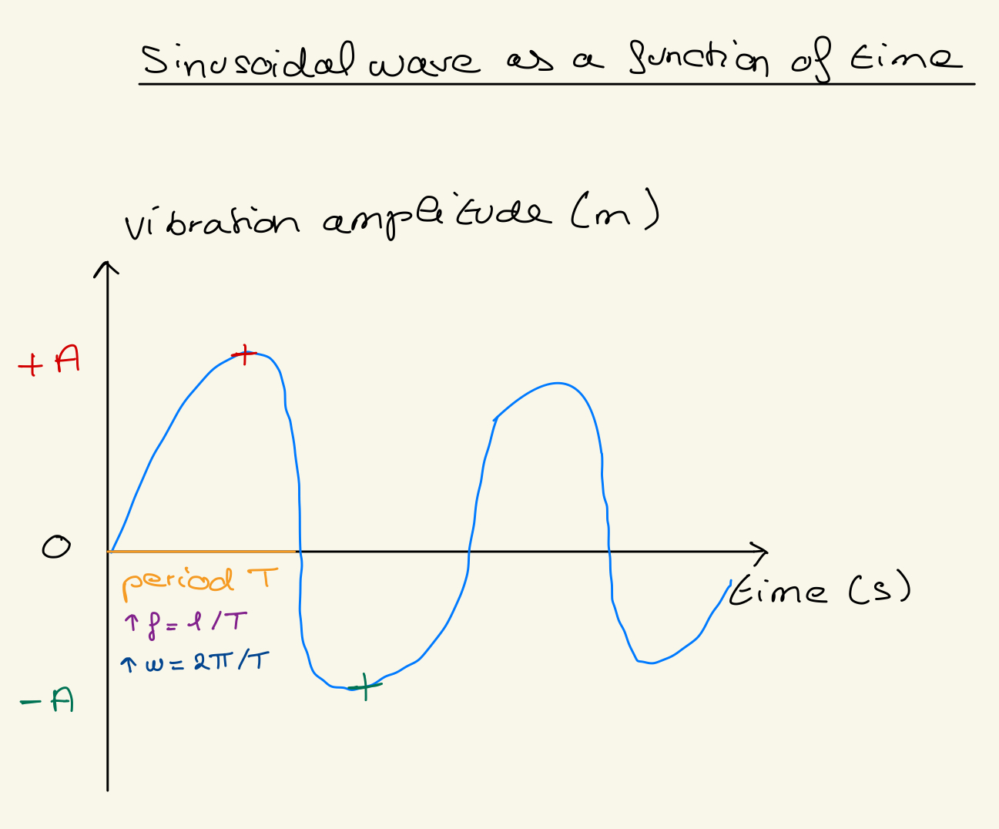
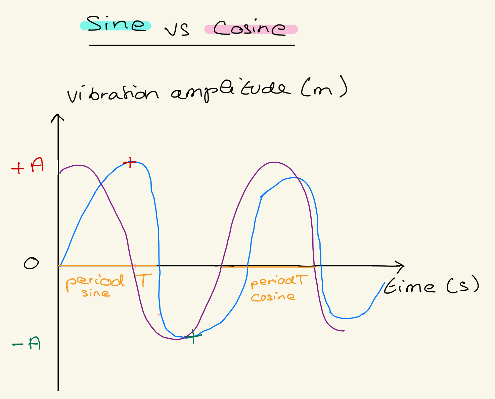
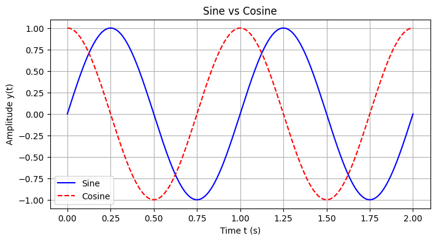

# Preseries02_python_sinusoidal_signals
 Create a notebook to plot sinusoidal signals

## 1. What is a sinusoid ?
 Periodic wavy curve representing the trigonometric function called sine, used in physics in particular to represent vibratory phenomena.[Sinusoid](https://www.cnrtl.fr/lexicographie/sinuso%C3%AFde)

 ## 2. What (simple) physical phenomenon produces a sinusoid?

The vibrations of a stretched string generate a sinusoid describing the movement of the waves (example: guitar string).
[Simple_phenomenon](https://moodle.luniversitenumerique.fr/course/view.php?id=171)

## 3. Draw a diagram of a sine curve as a function of time (do it by hand before scouting for images?)

## 4. What is the equation of a sinusoid?
Equation: y(t)=Asin(ωt+ϕ)
| Term       | Meaning                                               | Unit                           |
|------------|-------------------------------------------------------|--------------------------------|
| y(t)       | Value of the sinusoid at time t                      | meters (m) or signal units     |
| A          | Maximum amplitude (peak height)                      | meters (m) or signal units     |
| ω          | Angular frequency (wave speed)                       | radians per second (rad/s)     |
| t          | Time                                                  | seconds (s)                    |
| φ          | Initial phase (horizontal shift of the sinusoid)    | radians (rad)                  |

**Unit of the full equation:** y(t) has the same unit as the amplitude A, since sin() is dimensionless.

## 5. Define (in plain English + give unit) and illustrate (on a diagram that you manually drew)

### Key Terms

| Term        | Definition                                                       | Unit                         |
|------------|------------------------------------------------------------------|-------------------------------|
| Amplitude (A) | Maximum value of the wave from the equilibrium position        | meters (m) or signal units   |
| Period (T)    | Time needed for one complete wave cycle                         | seconds (s)                  |
| Frequency (f) | Number of complete cycles per second, f = 1/ T                           | Hertz (Hz) = 1/s           |
| Angular frequency / Pulsation (ω) | Oscillation speed in radians per second; ω = 2πf = 2π/T | radians per second (rad/s) |

### Sinusoidal wave as a function of time

### Diagram Annotations
- **Amplitude (A):** +A (crest), -A (trough)  
- **Period (T):** horizontal distance between two consecutive crests  
- **Frequency (f):** number of cycles per second  
- **Angular frequency (ω):** one full wave represents 2π radians

## 6. What is the difference between a sine and a cosine?

## Main Difference
The main difference is a **phase shift**:
- Cosine is equivalent to a sine shifted **π/2 radians to the left**:
  \[
  \cos(x) =sin(x+π/2)
  \]
- Shape difference:
  - Sine starts at **0** at t = 0 (if no phase shift).
  - Cosine starts at **+A** (maximum amplitude) at t = 0.

## Cosine Equation in Terms of Sine
If sine is:
\[
y(t) =Asin(ωt+ϕ)
\]

Then the corresponding cosine is:
\[
y(t) =Acos(ωt+ϕ)=Asin(ωt+ϕ+π/2)
\]

- **A** : amplitude  
- **ω** : angular frequency  
- **φ** : initial phase  
- **t** : time  

## Diagram (ASCII) Comparing Sine and Cosine

### Explanation
- **Cosine** starts at **maximum amplitude (+A)** at t = 0.  
- **Sine** starts at **0** at t = 0.  
- Both have the **same amplitude, period, frequency, and angular frequency**.  
- The difference is a **horizontal shift of π/2 radians**.

## 7. Explain why a sinusoid is a periodic signal
A sinusoid is a periodic signal because its shape repeats identically at regular intervals, with a constant period.[Laurent Oudre, TNS2, 2017-2018](https://www.laurentoudre.fr/tns/TNS2_hand.pdf)

## 8.Explain why a sinusoid is a continuous signal
A sinusoid x(t)=Asin(ωt+ϕ) is a continuous signal because it is defined at every instant t, taking values for all real time points.[Laurent Oudre, TNS2, 2017-2018](https://www.laurentoudre.fr/tns/TNS2_hand.pdf)

## 9. Explain why a sinusoid is a parametric signal, and with which parameters
A sinusoid is a parametric signal because it depends on the parameters amplitude, frequency, phase and time.
[Signaux_sinusoïdaux_Aabu](https://zestedesavoir.com/tutoriels/2451/les-signaux-sinusoidaux-en-physique/les-signaux-sinusoidaux/)

## 10. References
[Analyse_fréquentielle_du_signal_Bahouri_Vigneron](https://hal.science/hal-02350738/file/AFS.pdf)

[Laurent Oudre, TNS2, 2017-2018](https://www.laurentoudre.fr/tns/TNS2_hand.pdf)

[Somme_siganux_sinusoïdaux_Chareyron](https://culturesciencesphysique.ens-lyon.fr/pdf/somme-sinus-python.pdf)

## 11. Provide the time you spent on this assignment
It took me two and a half hours to complete this assignment