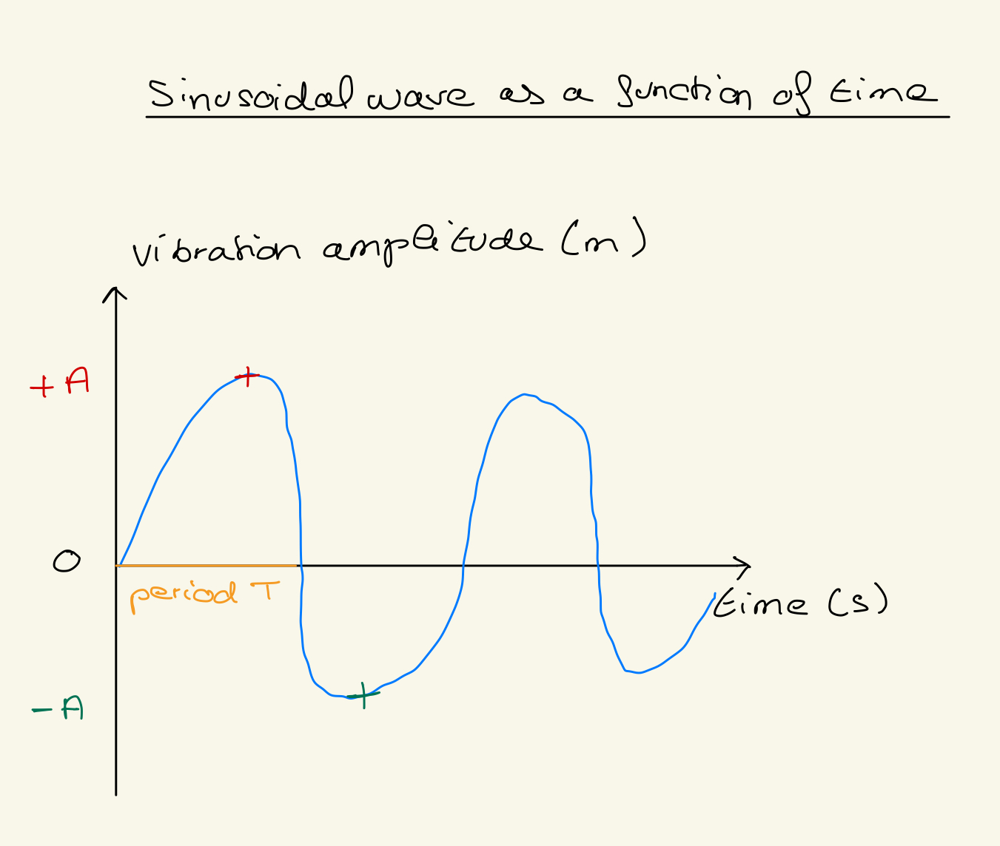
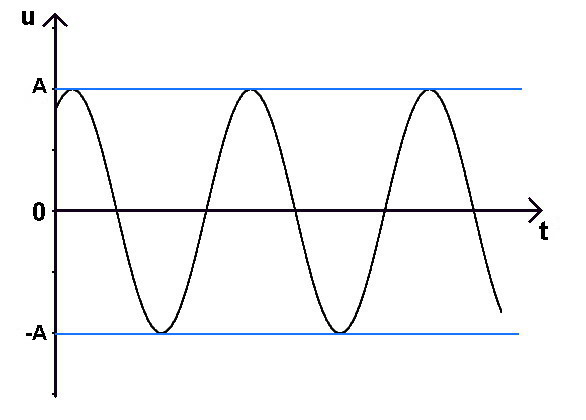

# Preseries02_python_sinusoidal_signals
 Create a notebook to plot sinusoidal signals

## 1. What is a sinusoid ?
 Periodic wavy curve representing the trigonometric function called sine, used in physics in particular to represent vibratory phenomena.[Sinusoid](https://www.cnrtl.fr/lexicographie/sinuso%C3%AFde)

 ## 2. What (simple) physical phenomenon produces a sinusoid?.

The vibrations of a stretched string generate a sinusoid describing the movement of the waves (example: guitar string).
[Simple_phenomenon](https://moodle.luniversitenumerique.fr/course/view.php?id=171)

## 3. Draw a diagram of a sine curve as a function of time (do it by hand before scouting for images?)

## 4. What is the equation of a sinusoid?
Equation: y(t)=Asin(ωt+ϕ)
| Term       | Meaning                                               | Unit                           |
|------------|-------------------------------------------------------|--------------------------------|
| y(t)       | Value of the sinusoid at time t                      | meters (m) or signal units     |
| A          | Maximum amplitude (peak height)                      | meters (m) or signal units     |
| ω          | Angular frequency (wave speed)                       | radians per second (rad/s)     |
| t          | Time                                                  | seconds (s)                    |
| φ          | Initial phase (horizontal shift of the sinusoid)    | radians (rad)                  |

**Unit of the full equation:** y(t) has the same unit as the amplitude A, since sin() is dimensionless.

## 5. Define (in plain English + give unit) and illustrate (on a diagram that you manually drew)

### Key Terms

| Term        | Definition                                                       | Unit                         |
|------------|------------------------------------------------------------------|-------------------------------|
| Amplitude (A) | Maximum value of the wave from the equilibrium position        | meters (m) or signal units   |
| Period (T)    | Time needed for one complete wave cycle                         | seconds (s)                  |
| Frequency (f) | Number of complete cycles per second, f = 1/ T                           | Hertz (Hz) = 1/s           |
| Angular frequency / Pulsation (ω) | Oscillation speed in radians per second; ω = 2πf = 2π/T | radians per second (rad/s) |

### Sinusoidal wave as a function of time

### Diagram Annotations
- **Amplitude (A):** +A (crest), -A (trough)  
- **Period (T):** horizontal distance between two consecutive crests  
- **Frequency (f):** number of cycles per second  
- **Angular frequency (ω):** one full wave represents 2π radians

